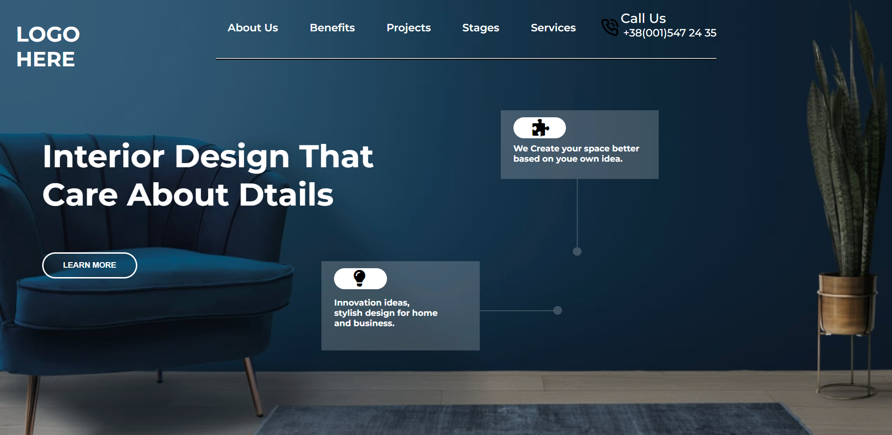

# Project-10-  Home Interior Template 
 ## Hey there ,  I am Amarjeet 
 I have build a template of HTML and CSS project using my core css skills 
 
 
 
 

 My Live Deployed Website Link :- [Click here !](https://project-11-creative-hub.netlify.app/)

 
 

 ## This project takes almost 4 hours .

 ## What I have learned in this project .
 - A little bit about icons.
 - how blur our backgound image or color by the help of linear ingrediant.
 - Hover Effets .
 - Image positioning.
